# BoomBang HTML5

Recreación no oficial de BoomBang desarrollada con tecnologías web modernas. El proyecto reconstruye la experiencia multijugador con un cliente HTML5, un servidor en tiempo real, una API de gestión y un launcher de escritorio.

> Este es un proyecto independiente creado con fines de desarrollo y preservación. No está afiliado, respaldado ni mantenido por los propietarios originales de BoomBang.

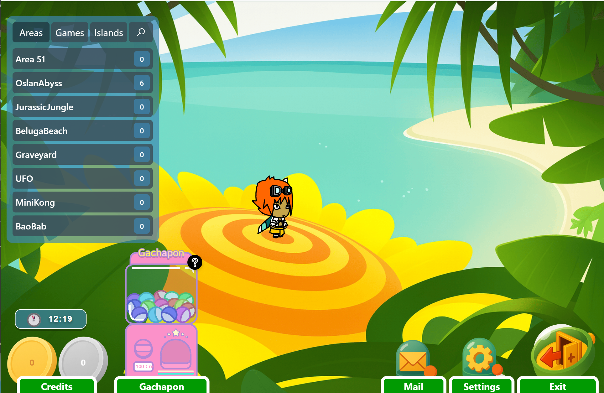

## Estado del proyecto

El proyecto se encuentra en desarrollo activo. Actualmente permite registrarse, entrar al lobby, explorar áreas públicas, crear islas con salas personalizables, interactuar con otros usuarios, comprar y coleccionar objetos y competir en el minijuego Golden Ring.

| Sistema | Estado |
| --- | --- |
| Autenticación y perfiles | Implementado |
| Lobby y navegación | Implementado |
| Salas públicas multijugador | Implementado |
| Islas y salas privadas | Implementado |
| Catálogo, compras e inventario | Implementado |
| Personalización de avatar | Implementado |
| Chat e interacciones sociales | Implementado |
| Golden Ring, matchmaking y ranking | Implementado |
| NPC, recompensas y eventos | Implementado |
| Gachapón y correo | Implementado |
| Bots conversacionales con IA | Implementado |
| Panel administrativo | Implementado |
| Launcher de escritorio | Implementado |

## Galería

### Salas públicas

Áreas multijugador en tiempo real con movimiento por casillas, chat, usuarios conectados, objetos coleccionables, NPC, sonidos ambientales, accesos entre escenas y eventos.

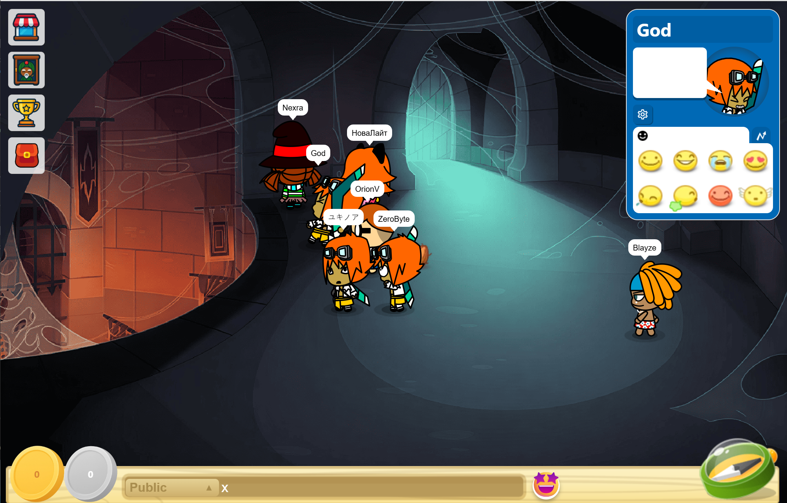

### Islas y salas privadas

Cada usuario puede crear sus propias islas, añadir salas privadas, elegir su distribución, cambiar colores y nombres y decorarlas con objetos de su inventario. También es posible buscar, visitar y eliminar islas.

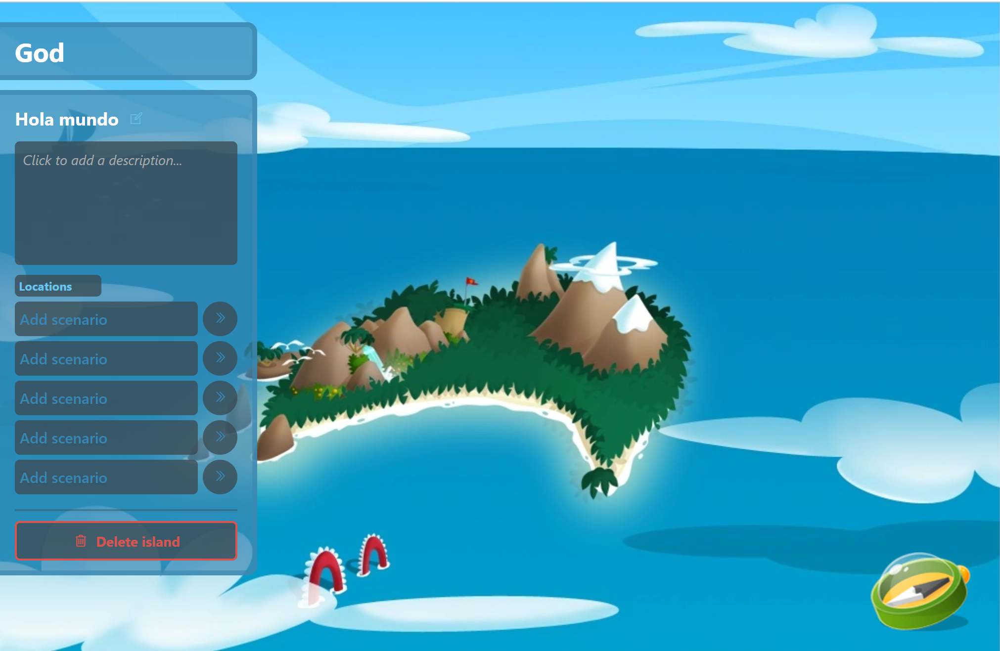

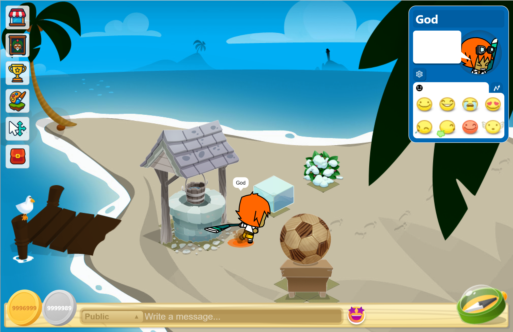

### Minijuegos

Golden Ring incluye inscripción mediante matchmaking, partida multijugador sincronizada, puntuaciones, clasificación semanal y recompensas.

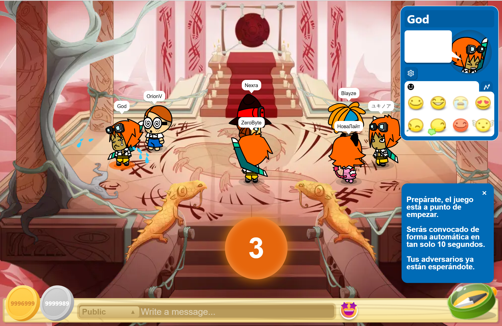

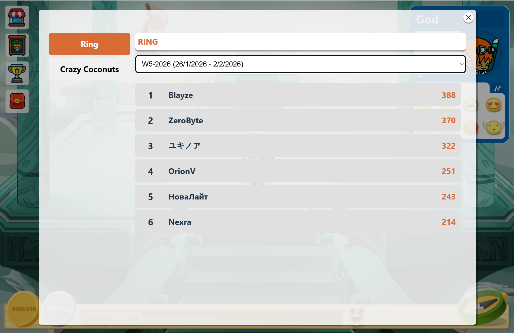

### Catálogo e inventario

El catálogo permite organizar objetos por categorías, comprar artículos con distintos tipos de moneda, controlar cantidades y requisitos y gestionar los objetos adquiridos desde el inventario.

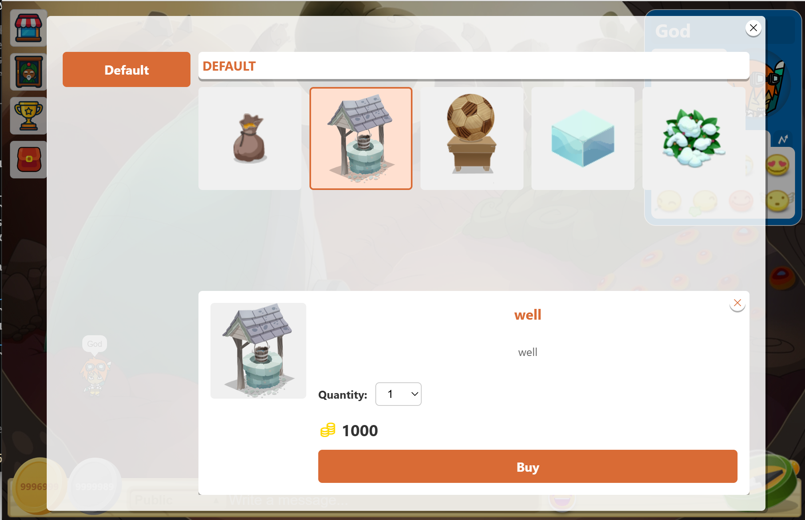

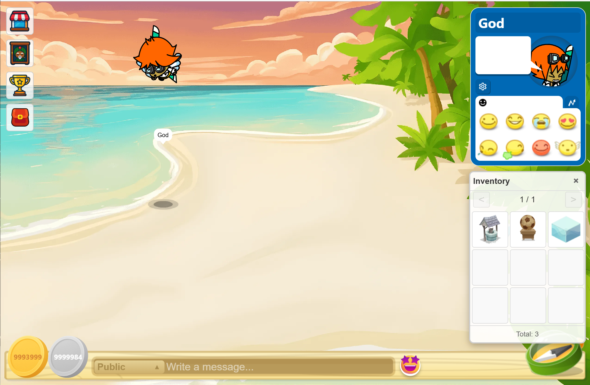

### Personalización y perfil

El cliente incluye 17 avatares con animaciones, selección de aspecto, ficha personal, descripción, color de nombre, sombra, chat y objetos arrojables. Las tarjetas de usuario muestran estadísticas, emojis e interacciones.

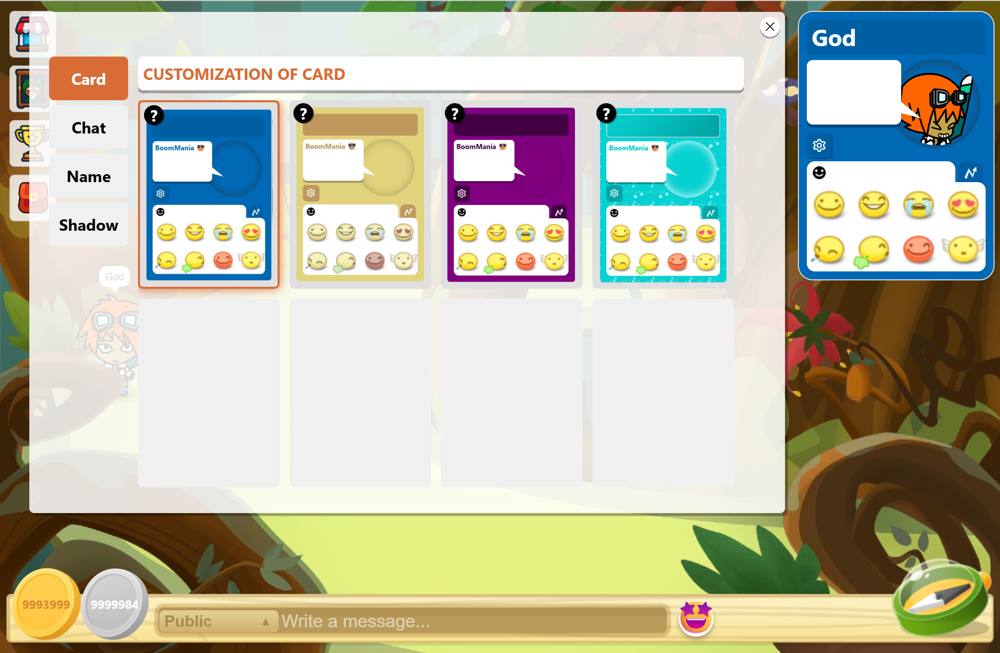

### Lobby y sistemas adicionales

Desde el lobby se accede a las áreas, islas y juegos. También incluye tutorial, buscador, favoritos, ajustes de idioma, gráficos y sonido, gachapón, correo con recompensas y reloj de juego.

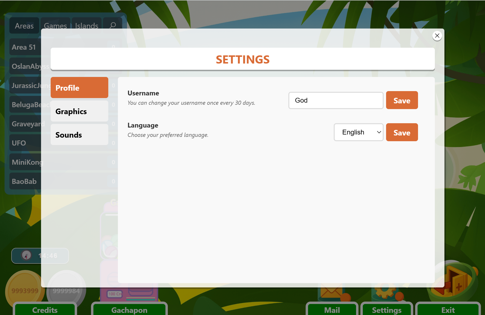

### Administración

El panel de administración permite gestionar usuarios, roles, salas, islas, catálogo, inventarios, NPC, eventos, minijuegos, puntuaciones, recompensas, correo, claves de API y el estado del servidor.

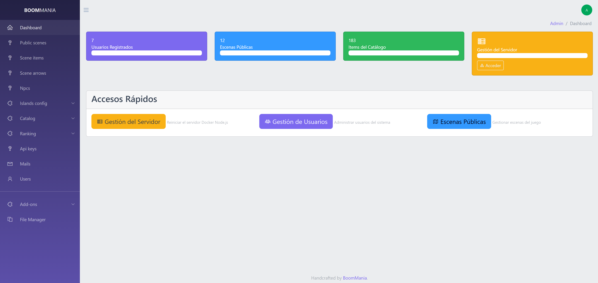

## Funcionalidades desarrolladas

### Mundo multijugador

- Comunicación en tiempo real mediante Socket.IO.
- Movimiento sincronizado y navegación entre escenas.
- Salas públicas, salas privadas, islas y escenas de minijuegos.
- Chat sobre el avatar, menciones, lista de usuarios y emojis.
- Interacciones entre jugadores, uppercuts y 10 tipos de objetos arrojables.
- Fichas de usuario, estadísticas y personalización visual.
- Objetos que aparecen y pueden recogerse en salas públicas.
- NPC con catálogos, requisitos y entrega de objetos.

### Economía y progresión

- Catálogo organizado por categorías.
- Compra de objetos, inventario y límites de cantidad.
- Decoración y colocación de objetos en salas privadas.
- Créditos, recompensas, eventos y puntuaciones.
- Gachapón con premios.
- Correo interno con recompensas reclamables.
- Integración preparada para pagos mediante Stripe.

### Minijuegos

- Golden Ring como primer minijuego jugable.
- Sistema de inscripción y matchmaking.
- Instancias de partida independientes.
- Ranking semanal, puntuaciones y recompensas.

### Plataforma

- Registro, inicio de sesión y acceso con Google.
- Autenticación con Laravel Passport.
- Interfaz multidioma.
- Caché y versionado de recursos del cliente.
- Bots conversacionales con contexto, memoria, cuotas y proveedores de IA.
- Panel administrativo construido con Backpack for Laravel.
- Launcher de Windows construido con Electron.

## Arquitectura

```text
┌──────────────────────┐       Socket.IO       ┌──────────────────────┐
│ Cliente Vue + Phaser │ ◄───────────────────► │ Servidor Node.js     │
└──────────┬───────────┘                       └──────────┬───────────┘
           │ HTTP                                         │ HTTP
           ▼                                              ▼
┌──────────────────────┐                       ┌──────────────────────┐
│ API Laravel          │ ◄───────────────────► │ MariaDB              │
│ + Panel Backpack     │                       │ boombang_api         │
└──────────────────────┘                       └──────────────────────┘
```

| Directorio | Tecnología | Responsabilidad |
| --- | --- | --- |
| `client/` | Vue 3, Phaser 3, Vite, Pinia | Interfaz y renderizado del juego |
| `server/` | Node.js, Express, Socket.IO | Lógica multijugador en tiempo real |
| `api/` | Laravel 12, Passport, Backpack | Datos, autenticación y administración |
| `launcher/` | Electron | Launcher de escritorio para Windows |
| `docker/` | Docker, MariaDB, nginx-proxy | Entorno e infraestructura local |

> `docker-compose.yml` también conserva la configuración de un servicio `web/` para el sitio público, pero ese directorio no está incluido actualmente en este repositorio.

## Tecnologías principales

- **Cliente:** Vue 3, Phaser 3.87, Pinia, Vite, GSAP y Vue I18n.
- **Servidor:** Node.js, Express, Socket.IO y MariaDB.
- **API:** PHP 8.2+, Laravel 12, Passport, Backpack y Stripe.
- **Infraestructura:** Docker Compose, MariaDB, nginx-proxy y phpMyAdmin.
- **Escritorio:** Electron y electron-builder.

## Puesta en marcha local

### Requisitos

- Docker Desktop
- Docker Compose v2
- Git

### Configuración

1. Clona el repositorio y entra en él:

   ```bash
   git clone https://github.com/GenRubiio/boombang-html5.git
   cd boombang-html5
   ```

2. Crea la red externa utilizada por el proxy:

   ```bash
   docker network create proxy-network
   ```

3. Crea los archivos de entorno a partir de los ejemplos y configura sus valores:

   ```powershell
   Copy-Item .env.example .env
   Copy-Item api/.env.example api/.env
   Copy-Item server/.env.example server/.env
   Copy-Item client/.env.example client/.env
   ```

4. Añade los dominios locales al archivo `C:\Windows\System32\drivers\etc\hosts`:

   ```text
   127.0.0.1 boombang.com
   127.0.0.1 api.boombang.com
   127.0.0.1 server.boombang.com
   127.0.0.1 play.boombang.com
   127.0.0.1 pma.boombang.com
   ```

5. Levanta los servicios disponibles:

   ```bash
   docker compose up db phpmyadmin api server client --build
   ```

6. Ejecuta las migraciones y carga los datos iniciales:

   ```bash
   docker compose exec api php artisan migrate --force --no-interaction --seed
   docker compose exec api php artisan passport:install
   ```

7. Abre el cliente en [http://play.boombang.com](http://play.boombang.com).

> Los dominios locales requieren una instancia de `nginx-proxy` conectada a `proxy-network`. El comando anterior omite el servicio `web`, ya que su directorio no está incluido actualmente.

## Servicios locales

| Servicio | URL |
| --- | --- |
| Cliente del juego | [http://play.boombang.com](http://play.boombang.com) |
| API y panel administrativo | [http://api.boombang.com](http://api.boombang.com) |
| Servidor Socket.IO | [http://server.boombang.com:3000](http://server.boombang.com:3000) |
| phpMyAdmin | [http://pma.boombang.com](http://pma.boombang.com) |

## Comandos útiles

```bash
docker compose up -d
docker compose logs -f
docker compose build server
docker compose exec api php artisan migrate --force --no-interaction --seed
docker compose exec api ./vendor/bin/phpunit
docker compose exec api ./vendor/bin/pint
docker compose down
```

Para limpiar completamente los recursos Docker del proyecto en Windows:

```powershell
.\docker-clean.ps1
```

## Documentación técnica

La carpeta [`doc/`](doc/) contiene documentación adicional sobre el sistema de avatares, bots conversacionales, caché, optimización y control de versiones del cliente.

## Licencia

Copyright © 2025 Evgeny Lyubeznyy. Todos los derechos reservados.

Consulta [`LICENSE.txt`](LICENSE.txt) para conocer las condiciones y restricciones de uso. Para solicitar autorización o una licencia, contacta con **#genrubio** mediante Discord.
