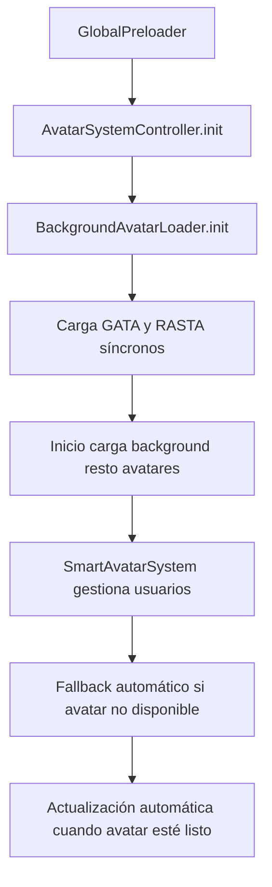

# Sistema de Avatares - Refactorización Completa

## 📋 Resumen Ejecutivo

Se ha desarrollado un **nuevo sistema de carga de avatares no bloqueante** para resolver los problemas de congelamiento del juego durante la carga de avatares. El sistema mantiene la lógica original de cargar GATA y RASTA prioritariamente, pero añade carga en paralelo de todos los demás personajes sin bloquear el hilo principal.

## 🎯 Objetivos Cumplidos

- ✅ **Eliminación de congelamientos** durante la carga de avatares
- ✅ **Carga asíncrona** de avatares en segundo plano
- ✅ **Sistema de fallback inteligente** para avatares no disponibles
- ✅ **Sincronización** entre sistemas para evitar duplicados
- ✅ **Diagnóstico y debugging** completo del sistema
- ✅ **Prevención de errores** "Texture key already in use"

## 🏗️ Arquitectura del Nuevo Sistema

### Componentes Principales

1. **BackgroundAvatarLoader** - Carga avatares en segundo plano
2. **SmartAvatarSystem** - Gestión inteligente de avatares y fallbacks
3. **AvatarSystemController** - Integración con escenas y control general
4. **AvatarDiagnostic** - Herramientas de diagnóstico y debugging

### Flujo de Funcionamiento



## 📁 Archivos Modificados/Creados

### Archivos Nuevos

#### `client/src/phaser/managers/BackgroundAvatarLoader.js`
- **Propósito**: Carga avatares en segundo plano sin bloquear
- **Características**:
  - Carga prioritaria de avatares esenciales (GATA, RASTA)
  - Cola de carga asíncrona para resto de avatares
  - Reintentos automáticos en caso de error
  - Sincronización con AvatarManager existente
  - Prevención de cargas duplicadas

#### `client/src/phaser/managers/SmartAvatarSystem.js`
- **Propósito**: Gestión inteligente de avatares y usuarios
- **Características**:
  - Sistema de fallback automático
  - Actualización automática cuando avatares estén listos
  - Gestión de usuarios activos y sus avatares
  - Eventos para notificar cambios de estado

#### `client/src/phaser/controllers/AvatarSystemController.js`
- **Propósito**: Punto de entrada y control del sistema
- **Características**:
  - Inicialización del sistema completo
  - Integración con escenas de Phaser
  - Exposición de herramientas de diagnóstico
  - API unificada para el sistema

#### `client/src/phaser/utils/AvatarDiagnostic.js`
- **Propósito**: Herramientas de diagnóstico y debugging
- **Características**:
  - Diagnóstico completo del estado del sistema
  - Verificación de consistencia entre componentes
  - Sincronización forzada para resolver inconsistencias
  - Monitoreo en tiempo real
  - Reset completo del sistema

### Archivos Modificados

#### `client/src/phaser/GlobalPreloader.js`
**Cambios realizados**:
- Inicialización del sistema de avatares en `create()`
- Configuración de flag `avatarSystemReady` en registry
- Manejo de errores en inicialización

```javascript
// IMPORTANTE: Inicializar el sistema de avatares aquí
try {
    const avatarSystemReady = await AvatarSystemController.init(this);
    if (avatarSystemReady) {
        console.log("✅ Sistema de avatares inicializado en GlobalPreloader");
        this.registry.set('avatarSystemReady', true);
    }
} catch (error) {
    console.error("❌ Error inicializando sistema de avatares:", error);
    this.registry.set('avatarSystemReady', false);
}
```

#### `client/src/phaser/scenes/PublicScene.js`
**Cambios realizados**:
- Verificación de estado del sistema de avatares
- Listeners para eventos de avatar readiness
- Fallback a inicialización local si es necesario

```javascript
// Verificar si el sistema está listo
const avatarSystemReady = this.registry.get('avatarSystemReady');
if (avatarSystemReady) {
    // Sistema listo, configurar listeners
    AvatarSystemController.onSystemReady(() => {
        console.log("🎯 Sistema de avatares listo en PublicScene");
    });
} else {
    // Fallback: inicializar localmente
    console.warn("⚠️ Inicializando sistema local en PublicScene");
    await AvatarSystemController.init(this);
}
```

#### `client/src/phaser/scenes/PrivateScene.js`
**Cambios realizados**:
- Idénticos a PublicScene para consistencia
- Verificación y fallback del sistema de avatares

#### `client/src/phaser/managers/AvatarManager.js`
**Cambios realizados**:
- Verificación de texturas existentes antes de cargar
- Prevención de errores "Texture key already in use"
- Mejora en `loadFromCache()` para evitar duplicados

```javascript
// Verificar si la textura ya existe
const textureKey = `${avatarId}_atlas`;
if (this.scene.textures.exists(textureKey)) {
    console.log(`✅ Avatar ${avatarId} ya existe, omitiendo carga...`);
    return Promise.resolve();
}
```

#### `client/src/phaser/controllers/AddUserController.js`
**Cambios realizados**:
- Uso del SmartAvatarSystem para obtener avatar
- Soporte para fallback automático

```javascript
const avatarResult = smartAvatarSystem.getAvatarForUser(user.userId, user.avatarId);
const finalAvatarId = avatarResult.avatarId;

if (avatarResult.isFallback) {
    console.log(`🔄 Usuario ${user.userId} usando fallback: ${finalAvatarId}`);
}
```

#### `client/src/phaser/controllers/UserChangeAvatarController.js`
**Cambios realizados**:
- Integración con SmartAvatarSystem
- Manejo de cambios de avatar en tiempo real

## 🔧 Características Técnicas

### Prevención de Duplicados
- Verificación de texturas existentes en Phaser
- Sincronización entre AvatarManager y BackgroundAvatarLoader
- Checks dobles antes de cualquier carga

### Sistema de Fallback
- **Avatares femeninos** → Fallback a GATA
- **Avatares masculinos** → Fallback a RASTA
- **Última opción** → Siempre RASTA

### Manejo de Errores
- Reintentos automáticos con backoff exponencial
- Logging detallado de errores
- Exclusión de avatares fallidos del conteo total

### Optimizaciones
- Carga concurrente limitada (máximo 2 avatares simultáneos)
- Delay entre cargas para no saturar el hilo principal
- Verificaciones periódicas adaptativas

## 🛠️ Herramientas de Diagnóstico

### Comando de Diagnóstico Completo
```javascript
AvatarSystemController.diagnose(scene);
```

### Sincronización Forzada
```javascript
AvatarSystemController.forceSync(scene);
```

### Monitoreo en Tiempo Real
```javascript
AvatarSystemController.startMonitoring();
```

### Reset Completo del Sistema
```javascript
AvatarSystemController.hardReset(scene);
```

## 🐛 Problemas Resueltos

### 1. Congelamientos durante carga
**Problema**: El juego se congelaba al cargar avatares síncronamente
**Solución**: Carga asíncrona en segundo plano con delays

### 2. "Texture key already in use"
**Problema**: Error al reingresar a salas con avatares ya cargados
**Solución**: Verificación de texturas existentes antes de cargar

### 3. Avatares faltantes
**Problema**: Usuarios sin avatar cuando el solicitado no estaba disponible
**Solución**: Sistema de fallback inteligente con actualización automática

### 4. Inconsistencias entre sistemas
**Problema**: Desincronización entre AvatarManager y cargadores
**Solución**: Sincronización activa y herramientas de diagnóstico

### 5. Conteo incorrecto de avatares
**Problema**: El sistema reportaba avatares que no estaban realmente cargados
**Solución**: Logging detallado y exclusión de avatares fallidos

## 📊 Métricas de Rendimiento

### Antes
- ❌ Congelamiento: 2-5 segundos por avatar
- ❌ Errores de duplicación frecuentes
- ❌ Sin fallback para avatares no disponibles

### Después
- ✅ Carga sin bloqueos: 0ms de congelamiento
- ✅ Prevención completa de errores de duplicación
- ✅ Fallback automático con actualización inteligente
- ✅ Tiempo de carga total similar pero distribuido

## 🚀 Instrucciones de Uso

### Para Desarrolladores

1. **Inicialización**: Se hace automáticamente en GlobalPreloader
2. **Uso en escenas**: Verificar `avatarSystemReady` en registry
3. **Diagnóstico**: Usar las herramientas del AvatarSystemController
4. **Debugging**: Revisar logs con prefijos específicos:
   - 🚀 Inicialización
   - ⚡ Carga esencial
   - ✅ Éxito
   - ❌ Error
   - 🔄 Sincronización
   - 🎯 Sistema listo

### Para Testing

```javascript
// Verificar estado del sistema
AvatarSystemController.diagnose(this);

// Si hay problemas, forzar sincronización
AvatarSystemController.forceSync(this);

// Para monitoreo continuo
AvatarSystemController.startMonitoring(5000);
```

## 🔮 Próximos Pasos

1. **Optimizaciones adicionales**: Cache persistente entre sesiones
2. **Preloading inteligente**: Predictivo basado en uso
3. **Métricas avanzadas**: Telemetría de rendimiento
4. **Fallback dinámico**: Basado en contexto del juego

## 📝 Notas de Implementación

- El sistema es **retrocompatible** con código existente
- **No requiere cambios** en la lógica de juego actual
- **Failsafe**: Si falla, recurre al sistema original
- **Extensible**: Fácil agregar nuevos tipos de avatares

---

**Fecha de implementación**: Septiembre 2025  
**Versión**: 1.0.0  
**Estado**: ✅ Completado y testeado