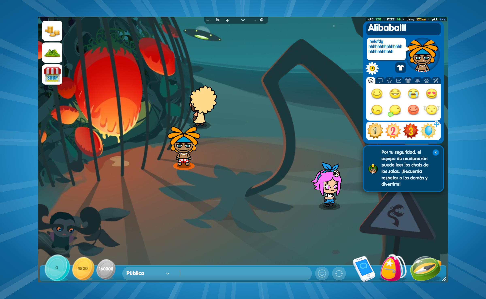
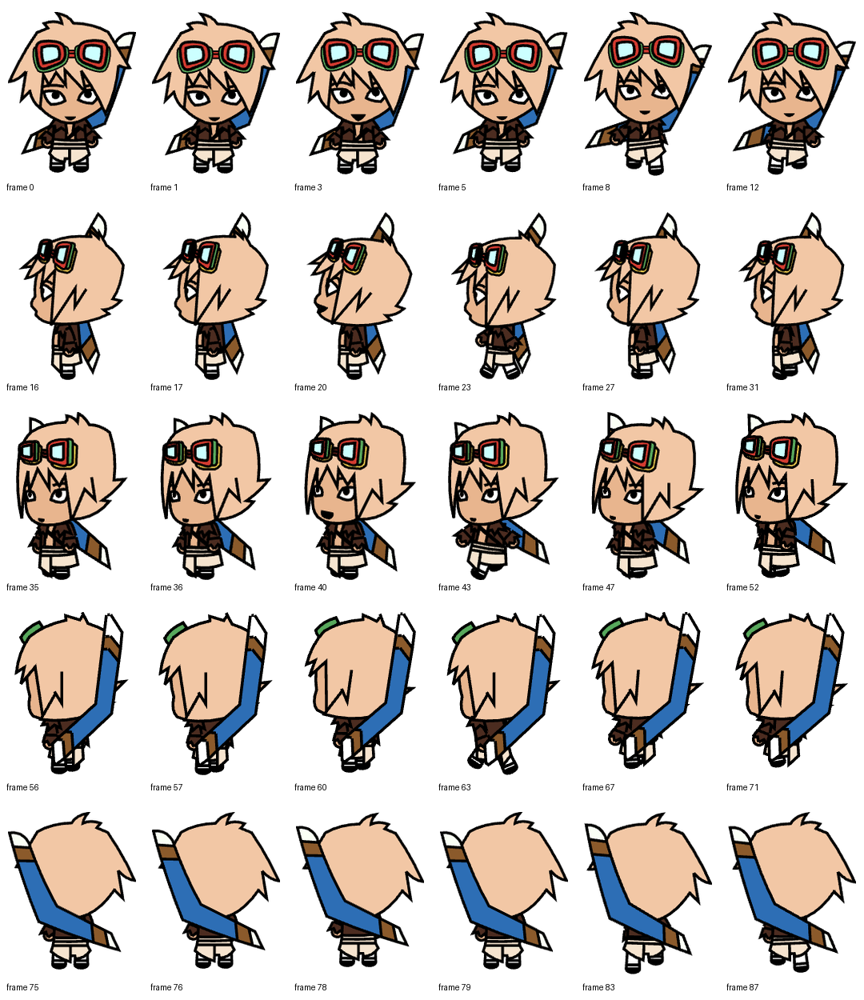
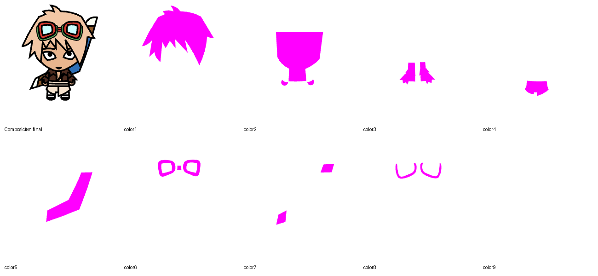

# Documento funcional y técnico: personajes por capas y colores personalizados

**Proyecto:** BoomBang HTML5  
**Versión:** 1.1  
**Fecha:** 15 de agosto de 2026  
**Objetivo:** especificar un sistema implementable de avatares animados por capas, con paletas variables de hasta nueve zonas, integrado con la arquitectura actual de `api/`, `server/` y `client/`.

> **Estado de la evidencia.** Análisis completado sobre el repositorio, `/Users/evgeny.lyubeznyy/Downloads/bommer.layers_extracted` y una sesión real de `boombang.tv`, validada el 15/08/2026 con Chrome DevTools MCP: login, entrada en `Choroni Island`, lectura del DOM, red, canvas y objetos PIXI en ejecución. No se almacenan credenciales ni datos de sesión.

## 1. Resumen ejecutivo

El proyecto actual representa cada usuario con un único `Phaser.GameObjects.Sprite`. El sprite reproduce frames ya rasterizados y empaquetados en un multiatlas WebP. Cada avatar es una entidad cerrada identificada por `avatar_id`; sus colores forman parte de las imágenes y no existe un modelo de paleta del avatar en API, servidor o cliente.

Los assets extraídos de `bommer.layers_extracted` contienen un modelo diferente y suficiente para construir personalización por colores: 91 frames únicos, 1.634 piezas PNG, 15 secuencias base y 2.424 colocaciones de capa. Cada colocación declara pieza, posición, tamaño y, cuando es coloreable, una ranura `color1` a `color9`. Las piezas coloreables son máscaras blancas con alfa; las piezas sin ranura contienen líneas, sombras y detalles fijos. El orden del array `L` es el orden de composición de atrás hacia delante. `ss: 2` y la correspondencia exacta `PNG = w × 2` / `h × 2` confirman que las piezas están a doble resolución.

La referencia confirma el mismo concepto, aunque con dos representaciones: el avatar visible inspeccionado usa primitivas vectoriales PIXI ordenadas y tintadas; además descarga un paquete raster `.layers.bb` con `_frames.json` y `p*.png`, estructuralmente equivalente al paquete extraído. El personaje no se monta en el DOM: el DOM contiene la UI y un único canvas WebGL2; dentro de ese canvas existe la jerarquía `AvatarInstance → Keko → clip → Graphics/capas`.

La solución recomendada para este proyecto es **mantener la fachada de un único objeto de avatar por usuario**, compartiendo assets y aplicando una paleta por instancia:

1. Un compilador de assets transforma las capas fuente en atlas alineados y un manifiesto normalizado.
2. Un renderer por capas aplica sólo las ranuras declaradas por cada avatar (hasta nueve) sin regenerar todos los frames.
3. API persiste una paleta validada por avatar; el servidor actúa como autoridad, la distribuye al entrar o cambiar de aspecto y el cliente la aplica al instante.
4. La interfaz actual de selección de avatar se amplía con editor de colores, previsualización y acciones Guardar/Restablecer.

Para reducir riesgo, se propone un primer corte vertical únicamente para Boomer y las 15 animaciones extraídas (`idle`, `talk`, `walk` en cinco orientaciones fuente; derecha se obtiene por espejo). Las animaciones especiales actuales siguen usando el atlas rasterizado y la paleta predeterminada hasta disponer de sus capas.

## 2. Alcance

### 2.1 Incluido

- Montaje visual del personaje a partir de capas, orden Z y pivote por frame.
- De una a nueve ranuras de color por avatar, según el manifiesto, con valores hexadecimales RGB.
- Persistencia de paletas, validación de propiedad del avatar y sincronización en tiempo real.
- Render en salas públicas, privadas y minijuegos.
- Cambio de avatar, cambio de colores, entrada de usuarios, reconexión y fallback de carga.
- Editor Vue dentro del selector de avatares.
- Previsualizaciones de ficha/cara coherentes con la paleta.
- Compilación, versionado, caché, telemetría, pruebas y despliegue gradual.
- Compatibilidad con sombras, nombres, chat, uppercut y animaciones existentes.

### 2.2 Fuera del primer corte

- Personalización geométrica o sustitución de prendas/piezas.
- Comercio individual de cada color, salvo que negocio lo solicite después.
- Conversión de los otros 16 avatares sin disponer de sus capas.
- Rehacer animaciones especiales de Boomer que no aparecen en el paquete extraído.
- Replicar el renderer vectorial propietario del sitio; se reproduce su contrato funcional con los assets raster por capas disponibles.

## 3. Fuentes y nivel de certeza

| Fuente | Qué aporta | Estado |
|---|---|---|
| Repositorio actual | Flujo de carga, render, sockets, API, catálogo y UI | Confirmado |
| `bommer.layers_extracted` | Capas, zonas, frames, pivotes y secuencias | Confirmado |
| Composición visual generada | Interpretación de las nueve zonas | Confirmado para geometría; nombres semánticos por validar |
| `boombang.tv/play.html` y app estática | DOM, canvas, PIXI runtime, red, paleta y jerarquía visual | Confirmado en navegador |
| `rasta.bb` / `rasta.layers.bb` | Paquetes descargados por el cliente de referencia | Confirmado por red y cabeceras ZIP |

La semántica exacta de las zonas es específica de cada personaje: Rasta declara siete colores y etiquetas propias; Boomer declara hasta nueve ranuras. Por tanto, el contrato no debe imponer nueve valores a todos los avatares.

### 3.1 Validación viva del juego de referencia

- La URL exterior contiene un `iframe`; la aplicación real se ejecuta en `static.boombang.tv/betahtml5/index.html?lang=es`.
- El mundo se dibuja en `canvas#BoomBangCanvas`, WebGL2, a 2× de la medida CSS observada.
- `window.PIXI.VERSION` devuelve `8.19.0`.
- Los personajes no son elementos DOM. El DOM contiene UI, ficha, pestañas, chat y el canvas.
- En runtime, la jerarquía observada es `AvatarInstance (en) → Keko (de) → animationCache → clip (ur) → body → PIXI.Graphics`.
- El frame `rasta/down_idle` observado tiene 51 primitivas vectoriales que se materializan en 41 objetos `Graphics`: rellenos tintables y trazos/detalles fijos conservan su orden Z.
- `colormeta` aporta defaults y etiquetas; para Rasta se observaron `piel`, `rastas`, `cinta`, `bañador`, `ojos` y `guante`.
- La paleta activa `kekoColors` es una cadena concatenada de RGB. En Rasta contiene siete grupos de seis hexadecimales; las ranuras ausentes usan defaults. No es un contrato fijo de 54 caracteres.
- La red descarga `rasta.bb` (ZIP cifrado con frames vectoriales/triángulos) y `rasta.layers.bb` (ZIP cifrado con `_frames.json`, secuencias y `p*.png`). Este último coincide con el formato entregado para Boomer.



## 4. Funcionamiento actual del proyecto

### 4.1 Carga de assets

- `GlobalPreloader.js` llama a `AvatarAnimationsLoad.preload()`.
- `AvatarManager` carga inicialmente Gata y Rasta y carga el resto bajo demanda.
- Cada avatar tiene un loader específico, por ejemplo `AvatarBoomerLoad.js`, que importa páginas WebP y `atlas.json`.
- `AvatarsDataPreload.js` publica en `window.avatars_config` el mapa de animaciones de los 17 avatares.
- `AvatarManager.createAvatarAnimations()` crea animaciones Phaser con nombres `{avatarId}_{animationName}`.
- `CacheManager`, `AssetVersionManager` y `BackgroundAvatarLoader` gestionan IndexedDB, versión, precarga y fallback.

### 4.2 Montaje del usuario en escena

`AddUserController` crea un `Phaser.Container` con este orden:

1. sombra;
2. un único sprite de avatar;
3. fondo del nombre;
4. texto del nombre.

El contenedor se posiciona en la proyección isométrica y su profundidad usa la coordenada Y. El sprite aplica `positionX`, `positionY`, `flip_horizontally` y escala desde el `config.json` del avatar. No hay sub-sprites para pelo, piel o ropa.

### 4.3 Dirección y animación

- El juego maneja ocho direcciones lógicas.
- Los assets almacenan cinco orientaciones: abajo, izquierda-abajo, izquierda, izquierda-arriba y arriba.
- Las tres orientaciones derechas reutilizan el material izquierdo con `flipX = true`.
- Boomer usa 19 FPS en su configuración actual.
- El atlas actual ya incluye `idle`, `talk`, `walk` y muchas animaciones especiales.

### 4.4 Flujo de datos actual

1. API persiste `users.avatar` como entero.
2. `UserResource.php` expone `avatar_id` y la lista `avatars` habilitados por catálogo.
3. El servidor crea `UserModel.avatarId` y emite `UserResource` a los clientes de la sala.
4. `AvatarSelectionPopup.vue` emite `request:user_change_avatar`.
5. El servidor verifica que el avatar esté en `user.avatars`, persiste mediante API y emite `response:user_change_avatar` a la sala.
6. El cliente sustituye el sprite y mantiene posición/dirección.

### 4.5 Color existente

El proyecto ya usa `rexColorReplacePipeline` y `TintManager`, pero sólo para cambios puntuales como uppercuts y sombras. No existe una paleta de avatar. Encadenar nueve reemplazos sobre los sprites rasterizados actuales sería frágil: los colores están horneados, hay antialias y un mismo RGB puede aparecer en zonas que no deben cambiar.

## 5. Anatomía de `bommer.layers_extracted`

### 5.1 Inventario

| Métrica | Valor |
|---|---:|
| Tamaño total | 6,7 MB |
| Archivos | 1.651 |
| PNG de piezas | 1.634 |
| JSON | 17 |
| Frames únicos | 91 |
| Colocaciones de capa | 2.424 |
| Capas por frame | 20–31 (mediana 28; media 26,64) |
| Ranuras coloreables | 9 |
| Resolución fuente | 2× (`ss: 2`) |

### 5.2 Contrato de frame

`_frames.json` es un array. Cada elemento representa un frame único:

```json
{
  "o": [39.4, 103.05],
  "L": [
    { "p": 0, "x": 16.5, "y": 23, "w": 63.5, "h": 66.5, "s": "color7" },
    { "p": 2, "x": 8.5, "y": 12.5, "w": 74.5, "h": 92 }
  ]
}
```

- `o`: pivote lógico del frame, próximo a los pies; debe ser el ancla común de animación.
- `L`: capas en orden de composición.
- `p`: índice de `p{n}.png`.
- `x`, `y`: posición lógica de la esquina superior izquierda.
- `w`, `h`: tamaño lógico; el PNG mide exactamente el doble.
- `s`: ranura de color opcional. Sin `s`, la pieza conserva sus colores.

### 5.3 Secuencias

Los quince JSON de animación contienen índices de `_frames.json`, no nombres de PNG finales:

| Familia | Direcciones fuente | Frames declarados | Uso |
|---|---|---:|---|
| `idle` | down, leftdown, left, leftup, up | 1 por dirección | Bucle o frame estático |
| `talk` | mismas cinco | 9 por dirección | Secuencia con repeticiones intencionadas |
| `walk` | mismas cinco | 13 por dirección | Bucle; algunos índices se repiten |

El sistema debe preservar la lista exacta, incluidas repeticiones. No debe convertirla simplemente en un rango `start/end` porque se perdería el timing visual.

### 5.4 Ranuras observadas

| Ranura | Presencia | Interpretación visual inicial |
|---|---:|---|
| `color1` | 123 capas | Pelo |
| `color2` | 314 capas | Piel/cuerpo principal |
| `color3` | 386 capas | Prenda/guantes/botas principal |
| `color4` | 91 capas | Prenda clara inferior |
| `color5` | 91 capas | Accesorio largo/espada o pañuelo |
| `color6` | 72 capas | Montura exterior de gafas |
| `color7` | 91 capas | Detalle secundario de ropa/accesorio |
| `color8` | 75 capas | Montura interior de gafas |
| `color9` | 40 capas | Detalle presente sólo en determinados ángulos |

Los nombres semánticos son etiquetas de trabajo, no contrato definitivo. El contrato persistido debe conservar `color1`…`color9` y permitir metadatos de presentación por avatar.

### 5.5 Reglas de montaje verificadas

1. Crear un lienzo transparente a resolución 2×.
2. Para cada capa de `L`, en orden:
   - cargar `p{p}.png`;
   - si existe `s`, multiplicar RGB por el color de la ranura conservando alfa;
   - dibujar en `(x × 2, y × 2)`.
3. Conservar `o` como pivote, no recentrar por el bounding box de cada frame.
4. Para salida 1×, reducir una vez después de componer; no reducir piezas por separado.
5. Las direcciones derechas se derivan por espejo horizontal y requieren corregir el pivote.

## 6. Objetivo funcional

Un usuario puede seleccionar un avatar que posea, editar las zonas de color habilitadas, previsualizar el resultado animado y guardar una paleta. Al entrar en una sala, todos los clientes ven el mismo avatar y los mismos colores. Un cambio confirmado se propaga sin recargar la sala, conserva la posición y reinicia de forma segura a `idle` en la dirección actual.

### 6.1 Historias de usuario

- Como jugador, quiero cambiar cada zona visible de mi personaje para crear una apariencia propia.
- Como jugador, quiero previsualizar el personaje caminando y hablando antes de guardar.
- Como jugador, quiero restablecer la paleta predeterminada del avatar.
- Como observador de una sala, quiero ver inmediatamente el aspecto guardado de cada usuario.
- Como administrador, quiero definir ranuras, nombres, orden, color predeterminado y si una ranura está habilitada.
- Como sistema, quiero rechazar avatares no poseídos, colores inválidos y payloads excesivos.

### 6.2 Reglas de negocio

- La paleta pertenece al par `(user_id, avatar_id)`; cambiar de avatar recupera su última paleta guardada.
- Un usuario sólo puede modificar un avatar presente en `enabledAvatars()`.
- Sólo se aceptan claves declaradas por el manifiesto del avatar.
- Cada color se normaliza a `#RRGGBB`; no se acepta alfa del usuario.
- El servidor nunca confía en el estado del cliente.
- Guardar la misma paleta es idempotente.
- Si falta una paleta, se usa la paleta predeterminada versionada del manifiesto.
- Si el cliente no soporta el pipeline, renderiza el atlas fallback con colores predeterminados.

## 7. UX propuesta

### 7.1 Selector de avatar

Mantener la galería actual y añadir un panel de personalización al seleccionar un avatar compatible:

- previsualizador centrado con selector `Quieto / Caminar / Hablar`;
- botones de dirección o rotación automática por las cinco vistas fuente;
- lista de chips de zona, usando etiqueta e icono definidos por manifiesto;
- paleta de colores recomendados y selector libre hexadecimal;
- comparación `Predeterminado / Actual`;
- acciones `Restablecer`, `Cancelar`, `Guardar`;
- estado de guardado, error y cooldown.

### 7.2 Interacción

- Cambiar un chip actualiza sólo la previsualización local.
- `Guardar` emite un único comando con avatar, paleta completa y versión de manifiesto.
- La UI queda deshabilitada hasta recibir confirmación.
- Si el servidor corrige o rechaza valores, la UI muestra el resultado autoritativo.
- Cerrar sin guardar descarta el borrador.

### 7.3 Accesibilidad

- No depender sólo del color: cada zona tiene nombre y estado textual.
- Mostrar el hexadecimal editable y validar contraste del control, no del diseño artístico.
- Controles navegables por teclado y foco visible.
- `aria-label` en zonas y botones de dirección.

## 8. Modelo de datos

### 8.1 Tabla nueva recomendada

`user_avatar_palettes`

| Campo | Tipo | Regla |
|---|---|---|
| `id` | bigint | PK |
| `user_id` | FK bigint | cascade delete |
| `avatar_id` | integer | ID existente |
| `palette` | longText | JSON; convención del proyecto: no usar tipo `json` |
| `manifest_version` | string(40) | versión usada al guardar |
| timestamps | timestamps | auditoría |

Índice único: `(user_id, avatar_id)`.

Ejemplo de `palette`:

```json
{
  "color1": "#FF6600",
  "color2": "#C4A44A",
  "color3": "#4A2F20",
  "color4": "#FFFFFF",
  "color5": "#0066CC",
  "color6": "#FF0000",
  "color7": "#996633",
  "color8": "#00CC99",
  "color9": "#FFCC00"
}
```

### 8.2 Entidad Laravel

Crear según las convenciones del repositorio:

- `api/app/Models/UserAvatarPalette.php`
- migración `create_user_avatar_palettes_table`
- `api/app/Http/Resources/UserAvatarPaletteResource.php`
- `api/app/Services/UserAvatarPaletteService.php`
- `api/app/Repositories/UserAvatarPaletteRepository/`
- `api/app/Http/Requests/UserAvatarPaletteRequest.php`
- controlador API para lectura/actualización.

No es necesario un CRUD comercial en el primer corte, pero sí una sección administrativa de manifiestos/paletas predeterminadas si dejan de vivir sólo en archivos.

## 9. Contratos API y Socket.IO

### 9.1 API interna servidor → Laravel

`POST /api/user/change-avatar-look`

```json
{
  "avatar_id": 1,
  "palette": {
    "color1": "#FF6600",
    "color2": "#C4A44A"
  },
  "manifest_version": "boomer-layers-v1"
}
```

Respuesta:

```json
{
  "success": true,
  "data": {
    "avatar_id": 1,
    "palette": { "color1": "#FF6600", "color2": "#C4A44A" },
    "manifest_version": "boomer-layers-v1"
  }
}
```

La API valida propiedad del avatar, claves permitidas, formato, número máximo de ranuras y versión compatible. No exige nueve claves: completa las ausentes con los defaults del manifiesto. Debe hacer `updateOrCreate` por usuario/avatar.

### 9.2 Recursos de usuario

Extender `api/app/Http/Resources/UserResource.php` y `server/src/resources/UserResource.js`:

```json
{
  "avatar_id": 1,
  "avatar_look": {
    "palette": { "color1": "#FF6600", "color2": "#C4A44A" },
    "manifest_version": "boomer-layers-v1"
  }
}
```

Sólo se envía la paleta activa del avatar actual en presencia de sala. Las paletas de todos los avatares se devuelven únicamente al propietario cuando abre el editor.

### 9.3 Eventos Socket.IO

| Evento | Dirección | Uso |
|---|---|---|
| `request:get_avatar_look` | cliente → servidor | Obtener manifiesto UI y paleta propia |
| `response:get_avatar_look` | servidor → cliente | Datos del editor |
| `request:user_change_avatar_look` | cliente → servidor | Guardar avatar/paleta |
| `response:user_change_avatar_look` | servidor → sala | Aplicar aspecto autoritativo |
| `response:user_change_avatar_look_ack` | servidor → emisor | Confirmación/error de UI |

Payload de broadcast:

```json
{
  "user": "socket-id",
  "avatar_id": 1,
  "palette": { "color1": "#FF6600", "color2": "#C4A44A" },
  "manifest_version": "boomer-layers-v1",
  "position": { "x": 4, "y": 7, "z": 2 }
}
```

La operación de avatar y paleta debe ser atómica para evitar ver el avatar nuevo con la paleta del anterior.

## 10. Pipeline de assets

### 10.1 Entrada normalizada

Crear `client/assets-src/avatars/boomer/layers/` o un paquete de build fuera de `src` con:

- `meta.json`;
- `_frames.json`;
- JSON de secuencias;
- `p*.png`.

No importar 1.634 PNG directamente desde Vue/Vite en runtime.

### 10.2 Compilador

Crear un script Node con `sharp`, por ejemplo `client/scripts/compile-layered-avatar.mjs`, que:

1. valide esquema y referencias;
2. verifique que todos los `p` existan;
3. verifique `PNG.width == w × ss` y `PNG.height == h × ss`;
4. calcule bounds sin perder pivote;
5. compile frames alineados;
6. genere atlas de fallback predeterminado;
7. genere texturas de contribución/paleta para el shader;
8. emita manifiesto de animaciones con listas explícitas;
9. produzca miniaturas y caras del editor;
10. escriba hash de versión y reporte de warnings.

### 10.3 Salida propuesta

```text
client/src/assets/game/avatars/boomer/layered/
├── manifest.json
├── fallback-atlas.json
├── fallback-0.webp
├── palette-atlas.json
├── base-0.webp
├── weights-a-0.webp
├── weights-b-0.webp
├── weights-c-0.webp
└── preview.webp
```

### 10.4 Representación de producción

La composición alfa normal es lineal respecto a los colores de las ranuras. El compilador puede almacenar, por píxel:

- contribución constante de capas fijas;
- peso de cada una de las nueve ranuras;
- alfa final.

Tres texturas RGBA contienen hasta doce pesos y una textura base contiene la contribución fija/alfa. El shader reconstruye el color con nueve uniformes. Esto preserva bordes antialias y capas solapadas mejor que un índice de material simple.

Si el coste o la compatibilidad del shader retrasan el MVP, usar un contenedor con las capas del frame en su orden `L`, tintando sólo las que tienen `s`. Es la implementación estructuralmente más próxima al paquete `.layers.bb` de referencia y permite validar pivote, orden y paleta antes de optimizar. No se debe asumir «base + nueve sprites»: un frame real contiene 20–31 piezas y una misma ranura puede aparecer en varias posiciones. Tras validar, agrupar por textura/material, usar batching o migrar al shader de contribuciones.

### 10.5 Correspondencia con el formato de referencia

| Concepto observado | Paquete extraído | Implementación objetivo |
|---|---|---|
| Origen/pivote por frame | `o` | `displayOrigin`/offset normalizado |
| Orden de dibujo | primitivas/capas en secuencia | array `L` sin reordenar |
| Zona tintable | `c: colorN` en vector | `s: colorN` en pieza PNG |
| Detalle fijo | fill/stroke sin referencia de color | pieza sin `s` |
| Paleta variable | `colormeta.defaults` + cadena RGB | `manifest.slots` + objeto `palette` |
| Secuencia | índices explícitos por animación | JSON de secuencia preservado |
| Espejo | vistas derechas derivadas | `flipX` + pivote corregido |

## 11. Arquitectura del cliente

### 11.1 Componentes nuevos

- `LayeredAvatarManifestLoader`: carga y valida manifiesto/atlas.
- `AvatarPalettePipeline`: shader y binding de las ranuras declaradas (hasta nueve).
- `AvatarLookManager`: aplica paleta, fallback, caché y versión.
- `LayeredAvatarSprite`: fachada compatible con `play`, `setFlipX`, posición y profundidad.
- `AvatarLookPreview.vue`: previsualizador aislado del sprite de sala.
- `AvatarColorEditor.vue`: controles de zonas y borrador.

### 11.2 Integración con código existente

- `AvatarManager`: distinguir renderer `baked` o `layered` por manifiesto.
- `AvatarsDataPreload`: admitir secuencias de índices explícitos, no sólo rangos.
- `AnimationUtils`: usar pivote del frame/manifiesto; mantener `flipX` y escala.
- `AddUserController`: pasar `avatar_look` a la fábrica de sprite.
- `UserChangeAvatarController`: sustituir avatar y paleta atómicamente.
- `UserModel`: añadir `avatarLook`, `manifestVersion` y paleta efectiva.
- `SceneResponseSockets`: escuchar el nuevo broadcast.
- `AvatarSelectionPopup.vue`: integrar editor y confirmación.
- `AssetVersionManager`/`CacheManager`: incluir versión del renderer y manifest en la clave.

### 11.3 Compatibilidad de animaciones

La fachada debe mantener la API usada por `UserIdleAnimation`, `UserWalkAnimation`, `UserChatAnimation`, uppercuts e interacciones. Para Boomer por capas:

- `idle`, `talk`, `walk`: renderer por capas;
- especiales sin capas: renderer baked actual y paleta predeterminada;
- al cruzar de renderer, conservar contenedor, posición, depth, dirección y visibilidad;
- al finalizar una especial, volver al idle por capas.

### 11.4 Pivote y espejo

El pivote por frame debe expresarse de forma normalizada respecto al canvas compilado. Para espejo horizontal:

`pivotXMirrored = frameWidth - pivotX`

No reutilizar únicamente los offsets actuales de `config.json`; el paquete extraído ya contiene un pivote por frame y las dimensiones cambian durante la marcha.

## 12. Arquitectura del servidor

### 12.1 Modelo en memoria

Extender `server/src/models/UserModel.js` con:

- `avatarLook`;
- `avatarManifestVersion`;
- helper `setAvatarLook(avatarId, palette, version)`.

### 12.2 Servicio y controlador

- `UserApiService.changeAvatarLook()` persiste en Laravel.
- `UserService.changeAvatarLook()` actualiza memoria sólo con respuesta válida.
- `UserChangeAvatarLookController` valida estado de sala/cooldown y emite.
- Añadir enums de request/response y registro en `scenesSockets.js`.

### 12.3 Autoridad y errores

No desconectar al usuario por un color inválido. Los errores funcionales deben responder con ACK `{success:false, code, message}`. Reservar `error_critical` para corrupción de sesión o fallo no recuperable. Aplicar límite de frecuencia independiente del cambio de avatar.

## 13. Arquitectura de API y administración

### 13.1 Validación

- `avatar_id`: entero y poseído.
- `palette`: array asociativo, máximo 9 claves.
- clave: lista permitida por avatar.
- valor: regex `^#[0-9A-Fa-f]{6}$`.
- `manifest_version`: conocida o migrable.
- payload máximo recomendado: 2 KB.

### 13.2 Manifiestos

El manifiesto de render debe vivir versionado con los assets del cliente. API necesita una copia ligera de la definición de ranuras para validar. Evitar duplicación manual generando durante build un artefacto compartido, por ejemplo `packages/avatar-manifests/boomer.json`, consumible por Node y copiable a Laravel.

### 13.3 Catálogo

El primer corte no cambia la propiedad del avatar: sigue usando `catalog_items.user_decoration_type = avatar`. Si se comercializan colores, añadir un tipo nuevo (`avatar_palette` o `avatar_color`) y validar entitlement por ranura/preset. No mezclar esa decisión con el renderer base.

## 14. Caché, rendimiento y memoria

### 14.1 Objetivos

- Mantener un objeto visual principal por usuario en producción.
- 60 FPS objetivo en escritorio con 25 usuarios visibles; mínimo aceptable 45 FPS en hardware objetivo.
- Cambio de paleta local visible en menos de 100 ms tras ACK si los assets están cargados.
- Entrada a sala sin bloquear por avatares no prioritarios: mantener fallback actual.
- Cero recompilación de atlas completo por frame de animación.

### 14.2 Claves de caché

`{avatarId}:{rendererVersion}:{manifestVersion}:{quality}:{atlasSignature}`

La paleta no debe formar parte de la clave de textura si se aplica por shader; así todos los usuarios comparten atlas GPU.

### 14.3 Degradación

1. WebGL + pipeline disponible: renderer por paleta.
2. Canvas o pipeline fallido: atlas fallback predeterminado.
3. Asset no cargado: Gata/Rasta como hoy, seguido de sustitución.
4. Manifiesto incompatible: registrar telemetría y usar fallback, nunca dejar sprite invisible permanentemente.

## 15. Riesgos y deuda detectada

| Riesgo | Impacto | Mitigación |
|---|---|---|
| Sólo hay capas para 15 animaciones de Boomer | Cambio visual en especiales | Política híbrida explícita y obtener capas restantes |
| Nombres semánticos de `color1..9` no confirmados | UI confusa | Validar visualmente y configurar labels por avatar |
| Renderer de referencia usa vector y el proyecto recibe raster por capas | Diferencias de borde/rendimiento | Reproducir contrato de pivote, Z y paleta; usar golden tests, no copiar implementación interna |
| Paletas de longitud variable | Defaults incorrectos o rechazo de avatares | Validar contra `manifest.slots`; completar ausentes, nunca exigir nueve |
| Pipeline de reemplazo actual no sirve para nueve zonas robustas | Artefactos de color | Shader de pesos compilados |
| Contenedor de 20–31 piezas en MVP | Draw calls/objetos altos | Limitar a feature flag, medir batching y migrar a shader |
| Doble origen: offsets actuales y `o` por frame | Saltos de animación | Unificar en manifiesto compilado y golden tests |
| Eventos fallback usan identificadores inconsistentes | Avatar puede no actualizar | Normalizar por `socketId`; hay comparaciones actuales con `username` |
| `UserResource.js` declara `avatar_id` dos veces | Confusión de contrato | Limpiar al tocar el recurso |
| Errores de selección actual desconectan al usuario | Mala UX/abuso fácil | ACK funcional sin desconexión |
| Paleta arbitraria puede ocultar detalles | Calidad visual | presets recomendados; no limitar salvo decisión de negocio |

## 16. Plan de implementación

### Fase 0 — Validación de referencia (completada)

- Sesión real, entrada en sala y captura de evidencia completadas mediante Chrome DevTools MCP.
- DOM, canvas, PIXI runtime, jerarquía, paleta y requests de assets inspeccionados.
- Confirmado que el número y significado de zonas depende del personaje.
- Queda como QA de implementación cambiar zonas una a una y comparar el resultado del nuevo cliente; no bloquea la arquitectura.

### Fase 1 — Compilador y golden render (2–4 días)

- Normalizar el paquete `bommer`.
- Implementar validador y compilador.
- Generar composiciones de referencia para los 91 frames y varias paletas.
- Comparar pivotes, orden y espejo.

### Fase 2 — Corte vertical cliente (3–5 días)

- Cargar Boomer layered bajo feature flag.
- Implementar renderer MVP, animaciones base y fallback.
- Integrar en `AddUserController` y cambios en sala.
- Medir rendimiento con 1, 10 y 25 usuarios.

### Fase 3 — Persistencia y sockets (3–5 días)

- Modelo/migración/repositorio/servicio/controlador Laravel.
- Modelo/servicio/controlador y eventos Node.
- Recursos de usuario y reconexión.
- Validación, ACKs y rate limit.

### Fase 4 — Editor Vue (3–5 días)

- Previsualizador, zonas, color picker, presets y reset.
- Guardado atómico y estados de error.
- Miniaturas y ficha/cara coloreadas.

### Fase 5 — Renderer de producción (4–7 días)

- Pipeline de contribuciones/pesos.
- Caché/versionado, fallback Canvas y pruebas de contexto WebGL perdido.
- Presupuesto de GPU y memoria.

### Fase 6 — Rollout (2–3 días)

- Activar sólo para cuentas internas.
- 10 %, 50 %, 100 % de usuarios.
- Observar errores de shader, tiempo de sala, FPS y fallbacks.

Estimación orientativa total: 17–30 días de desarrollo y QA para un avatar con renderer productivo, sin contar la extracción de animaciones especiales ni la conversión del resto de avatares.

## 17. Pruebas y criterios de aceptación

### 17.1 Compilador

- Los 1.634 PNG están referenciados o reportados como no usados.
- No existen referencias a piezas ausentes.
- Los 91 frames se generan sin clipping.
- El pivote de pies no oscila perceptiblemente en `idle`.
- Las listas de secuencia conservan repeticiones exactas.
- Las vistas derechas son espejos correctos y no desplazan los pies.

### 17.2 Funcional

- Un usuario propietario guarda una paleta válida y la recupera tras reconectar.
- Otro usuario de la sala recibe el aspecto en un único broadcast coherente.
- Un avatar no poseído devuelve error sin persistir ni desconectar.
- Colores inválidos, claves extra y versiones desconocidas se rechazan.
- Restablecer elimina/sustituye la paleta y vuelve a defaults.
- Cambiar de avatar recupera la paleta específica de ese avatar.
- Entrada tardía a sala muestra la misma apariencia que los usuarios existentes.

### 17.3 Visual

- Golden images para 5 direcciones × 3 familias × paletas predeterminada, clara, oscura y saturada.
- No hay halos blancos, costuras, parpadeos o capas fuera de orden.
- Pelo, piel, ropa y accesorios cambian sólo en su ranura.
- Nombre, sombra y profundidad isométrica no cambian.
- Animaciones especiales realizan transición híbrida sin salto de posición superior a 2 px lógicos.

### 17.4 Rendimiento

- Escenarios automatizados de 1/10/25 avatares moviéndose y hablando.
- Medir FPS p50/p95, draw calls, texturas GPU y tiempo de entrada.
- No aumentar más de 20 % la memoria GPU frente al atlas compartido equivalente.
- Ninguna fuga tras entrar/salir de 20 salas.

## 18. Matriz de validación del juego de referencia

| Comprobación | Resultado | Evidencia/impacto |
|---|---|---|
| Login y entrada en sala | Completado | Sesión real en `Choroni Island` |
| Lectura del DOM | Completado | UI HTML + `canvas#BoomBangCanvas`; avatares fuera del DOM |
| Motor y renderer | Completado | PIXI 8.19, WebGL2, canvas a 2× |
| Jerarquía de personaje | Completado | `AvatarInstance → Keko → clip → body → Graphics` |
| Orden y composición | Completado | 51 primitivas / 41 Graphics en `down_idle` de Rasta |
| Paleta | Completado | slots etiquetados, defaults y cadena RGB de longitud variable |
| Paquete raster por capas | Completado | request `rasta.layers.bb`; ZIP con `_frames.json`, secuencias y `p*.png` |
| Varios usuarios personalizados | Completado visualmente | captura de sala con combinaciones diferentes |
| Cambio interactivo de cada zona | Pendiente de QA comparativo | ejecutar al implementar el editor, sin guardar cambios en la cuenta de referencia |
| Persistencia tras recarga | Pendiente de QA comparativo | verificar contra la implementación propia y restaurar paleta original |

## 19. Decisión de lanzamiento

La construcción puede arrancar sin más reverse engineering. El paquete extraído contiene el contrato necesario y el navegador confirmó que el sistema de referencia se basa en: geometría ordenada por frame, referencias de color por pieza, paleta por instancia, pivote estable, secuencias explícitas y render dentro del canvas. La diferencia vector/raster no cambia el contrato funcional.

El lanzamiento debe comenzar por la Fase 1 y no por persistencia: primero se exige un golden renderer local que recomponga los 91 frames de Boomer con cuatro paletas y demuestre orden, pivote, espejo y ausencia de halos. Sólo después se conectan sockets y base de datos.

## 20. Matriz de impacto por servicio y archivo

### 20.1 Cliente

| Archivo/área | Impacto requerido |
|---|---|
| `client/scripts/compile-layered-avatar.mjs` (nuevo) | Validar y compilar `_frames.json`, secuencias y `p*.png`; generar manifiesto, atlas/fallback y golden renders. |
| `client/src/assets/game/avatars/boomer/layered/` (nuevo) | Artefactos versionados de producción; nunca cargar los 1.634 PNG sueltos desde Vue. |
| `client/src/phaser/managers/AvatarManager.js` | Fábrica por estrategia `baked/layered`, carga compartida y API visual estable. |
| `client/src/phaser/managers/SmartAvatarSystem.js` | Fallback y sustitución usando `socketId`; corregir la comparación actual con `username`. |
| `client/src/phaser/managers/CacheManager.js` y `AssetVersionManager.js` | Incorporar versión/hash del manifiesto y purgar artefactos incompatibles. |
| `client/src/phaser/controllers/scene/AddUserController.js` | Crear el avatar con `avatar_look`; conservar sombra, nombre, profundidad y posición. |
| `client/src/phaser/controllers/scene/UserChangeAvatarController.js` | Cambiar avatar + paleta de forma atómica, sin recrear el contenedor completo. |
| `client/src/phaser/models/UserModel.js` | Guardar paleta efectiva y versión de manifiesto. |
| `client/src/utils/AnimationUtils.js` y animaciones Phaser | Secuencias explícitas, pivote por frame, espejo y transición a especiales baked. |
| `client/src/phaser/sockets/SceneResponseSockets.js` | Recibir ACK/broadcast del aspecto y aplicar al usuario correcto. |
| `client/src/enums/RequestSocketsEnum.js` / `ResponseSocketsEnum.js` | Nuevos eventos de lectura y cambio de aspecto. |
| `client/src/views/components/game/scenes/AvatarSelectionPopup.vue` | Integrar preview, chips de zona, reset, guardar/cancelar y errores. |
| `AvatarLookPreview.vue`, `AvatarColorEditor.vue` (nuevos) | Aislar preview y formulario para no acoplar Vue al sprite vivo de la sala. |

### 20.2 Servidor Node

| Archivo/área | Impacto requerido |
|---|---|
| `server/src/models/UserModel.js` | Añadir `avatarLook` y `avatarManifestVersion`. |
| `server/src/resources/UserResource.js` | Emitir `avatar_look` activo y eliminar la declaración duplicada de `avatar_id`. |
| `server/src/services/UserService.js` | Validación funcional, actualización autoritativa y operación atómica. |
| `server/src/services-api/UserApiService.js` | Persistir/recuperar aspecto mediante API interna. |
| `server/src/controllers/game/scenes/UserChangeAvatarController.js` | Mantener compatibilidad o delegar al nuevo controlador de aspecto. |
| `UserChangeAvatarLookController.js` (nuevo) | Ownership, cooldown, ACK, broadcast y errores no críticos. |
| `server/src/sockets/game/scenes/scenesSockets.js` | Registrar eventos nuevos para toda escena. |
| `server/src/enums/RequestSocketsEnum.js` / `ResponseSocketsEnum.js` | Contrato compartido de eventos. |

### 20.3 API Laravel

| Archivo/área | Impacto requerido |
|---|---|
| `api/database/migrations/*_create_user_avatar_palettes_table.php` | Persistencia por `(user_id, avatar_id)` en `longText`. |
| `api/app/Models/UserAvatarPalette.php` y `api/app/Models/User.php` | Entidad y relación; resolución de paleta activa. |
| `api/app/Repositories/UserAvatarPaletteRepository/` | Lectura y `updateOrCreate` siguiendo la arquitectura del proyecto. |
| `api/app/Services/UserAvatarPaletteService.php` | Defaults, normalización y compatibilidad de versión. |
| `api/app/Http/Requests/UserAvatarPaletteRequest.php` | Validación de claves/hex/payload. |
| `api/app/Http/Resources/UserAvatarPaletteResource.php` | Respuesta normalizada. |
| `api/app/Http/Resources/UserResource.php` | Incluir sólo el aspecto activo en presencia. |
| `api/app/Http/Controllers/Api/User/UserChangeAvatarController.php` | Conservar endpoint antiguo o redirigir a cambio atómico. |
| `api/app/Http/Controllers/Api/User/UserChangeAvatarLookController.php` (nuevo) | Persistencia interna del aspecto. |
| `api/routes/api.php` | Nueva ruta protegida para el emulador; no abrir tráfico directo adicional desde el cliente. |

### 20.4 Operación y despliegue

- Añadir comando de compilación y validación al build del cliente; fallar CI ante referencias rotas.
- Versionar manifiestos y artefactos compilados, no el directorio fuente fuera del repositorio sin trazabilidad.
- Migrar API antes de reiniciar servidor; desplegar cliente con feature flag desactivada y activarla después.
- Añadir métricas de fallback, tiempo de carga, error de manifiesto, FPS y memoria GPU.
- No cambia el protocolo Web/Laravel público: el cliente sigue usando Socket.IO para gameplay.
11. Capturar solicitudes WebSocket visibles sin almacenar tokens o credenciales.
12. Comparar tamaño, pivote, velocidad y frame order con el paquete extraído.

Si la referencia usa piezas intercambiables además de colores, abrir un alcance separado; no ampliar silenciosamente este diseño.

## 19. Definition of Done

El sistema se considera terminado para Boomer cuando:

- la referencia ha sido validada o sus diferencias están aceptadas por producto;
- las 15 animaciones por capas funcionan en 8 direcciones lógicas;
- nueve colores se guardan por usuario/avatar y se sincronizan en sala;
- el renderer productivo mantiene un sprite principal por usuario;
- existe fallback visible en Canvas, carga fallida y versión incompatible;
- golden tests, integración API/server/client y pruebas de rendimiento pasan;
- el despliegue está protegido por feature flag y tiene telemetría;
- la documentación de manifiesto permite añadir el siguiente avatar sin cambios estructurales.

## 20. Archivos con impacto principal

### Cliente

- `client/src/phaser/managers/AvatarManager.js`
- `client/src/phaser/managers/SmartAvatarSystem.js`
- `client/src/phaser/managers/BackgroundAvatarLoader.js`
- `client/src/phaser/managers/CacheManager.js`
- `client/src/phaser/managers/AssetVersionManager.js`
- `client/src/phaser/managers/TintManager.js`
- `client/src/phaser/controllers/scene/AddUserController.js`
- `client/src/phaser/controllers/scene/UserChangeAvatarController.js`
- `client/src/phaser/models/UserModel.js`
- `client/src/phaser/sockets/SceneResponseSockets.js`
- `client/src/phaser/preloaders/AvatarsDataPreload.js`
- `client/src/utils/AnimationUtils.js`
- `client/src/views/components/game/scenes/AvatarSelectionPopup.vue`
- `client/src/enums/RequestSocketsEnum.js`
- `client/src/enums/ResponseSocketsEnum.js`
- assets y config de `client/src/assets/game/avatars/boomer/`

### Servidor

- `server/src/models/UserModel.js`
- `server/src/resources/UserResource.js`
- `server/src/services/UserService.js`
- `server/src/services-api/UserApiService.js`
- `server/src/sockets/game/scenes/scenesSockets.js`
- enums de socket y nuevo controlador de aspecto.

### API

- `api/app/Models/User.php`
- `api/app/Http/Resources/UserResource.php`
- `api/routes/api.php`
- nueva entidad completa `UserAvatarPalette` y migración.

## 21. Decisiones que debe aceptar el equipo antes de empezar

1. Paleta por `(usuario, avatar)`, no una paleta global.
2. Nueve claves estables `color1..color9`; labels configurables.
3. Renderer productivo con atlas compartidos + shader, no atlas generado por usuario.
4. Política híbrida para animaciones especiales hasta disponer de sus capas.
5. Persistencia mediante tabla separada `longText` JSON.
6. Cambio de avatar y paleta atómico en Socket.IO.
7. Errores funcionales con ACK, sin desconexión.
8. Feature flag y rollout gradual comenzando sólo por Boomer.

---

### Apéndice A — Evidencia visual generada

- `doc/analysis/avatar_layers_assets/contact_sheet.png`: muestra representativa de los 91 frames compuestos.
- `doc/analysis/avatar_layers_assets/slot_anatomy_frame0.png`: aislamiento visual de las zonas del frame 0.





### Apéndice B — Hallazgo clave

El paquete no contiene sprites finales personalizables; contiene una descripción de escena 2D por frame. Las imágenes `p*.png` son piezas reutilizables. Las que tienen ranura son máscaras blancas con cuatro niveles principales de alfa y las piezas fijas conservan el dibujo. Por tanto, el sistema correcto debe tratar el avatar como **material parametrizado**, no como una colección de reemplazos RGB sobre el atlas actual.
